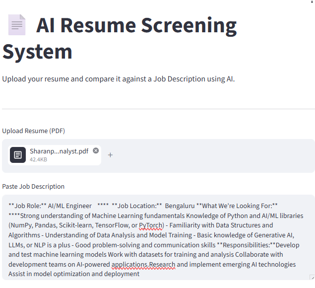
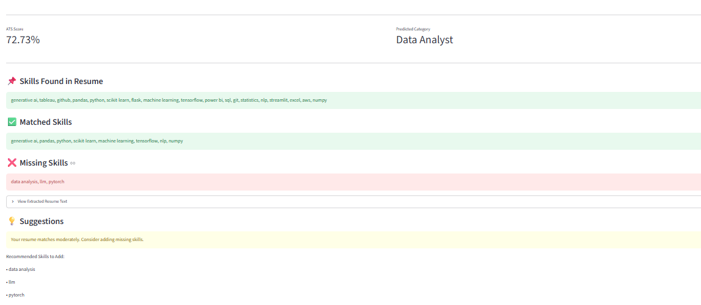

# 📄 AI Resume Screening System

An AI-powered Resume Screening and ATS Score Analyzer built using Python, Machine Learning, NLP, and Streamlit.

This application helps recruiters and job seekers analyze resumes against job descriptions, calculate ATS scores, identify missing skills, and classify resumes into different job categories.

---

# 📄 AI Resume Screening System

## 🚀 Live Demo

🔗 https://ai-resume-screening-system-8e5pndymstpzawrcysnwiv.streamlit.app/

An AI-powered Resume Screening and ATS Score Analyzer built using Python, Machine Learning, NLP, and Streamlit.

## 🚀 Features

✅ Upload Resume PDF

✅ Extract Resume Text Automatically

✅ Skill Extraction using NLP

✅ ATS Score Calculation

✅ Job Description Matching

✅ Missing Skills Detection

✅ Resume Category Prediction

✅ Interactive Streamlit Dashboard

✅ Machine Learning Model Integration

---

## 🛠️ Tech Stack

### Programming Language
- Python

### Libraries & Frameworks
- Streamlit
- Pandas
- NumPy
- Scikit-Learn
- Joblib
- PDFPlumber

### Machine Learning
- TF-IDF Vectorization
- Logistic Regression

### NLP
- Skill Extraction
- Resume Classification
- Text Processing

---

## 📂 Project Structure

```bash
AI-Resume-Screening-System/

├── app.py
├── train_model.py
├── requirements.txt
├── README.md
├── .gitignore

├── data/
│   ├── skills.csv
│   └── resume_dataset.csv

├── models/
│   ├── resume_classifier.pkl
│   └── tfidf_vectorizer.pkl

├── utils/
│   ├── pdf_parser.py
│   ├── skill_extractor.py
│   ├── ats_score.py
│   └── classifier.py

└── screenshots/
    ├── home_page.png
    └── ats_results.png
```

---

## ⚙️ Installation

### Clone Repository

```bash
git clone https://github.com/sharanprabhukudhalli8080/AI-Resume-Screening-System.git
```

### Move into Project Directory

```bash
cd AI-Resume-Screening-System
```

### Install Dependencies

```bash
pip install -r requirements.txt
```

---

## ▶️ Run Application

```bash
streamlit run app.py
```

Application will start on:

```bash
http://localhost:8501
```

---

## 📊 Workflow

```text
Resume PDF
     │
     ▼
PDF Text Extraction
     │
     ▼
Skill Extraction
     │
     ▼
Job Description Analysis
     │
     ▼
ATS Score Calculation
     │
     ▼
Resume Classification
     │
     ▼
Results Dashboard
```

---

## 📸 Screenshots

### Home Page



### ATS Analysis Result



---

## 🧠 Machine Learning Components

### Resume Classification

- TF-IDF Vectorization
- Logistic Regression
- Category Prediction

### ATS Scoring

- Skill Matching
- Missing Skill Detection
- Resume-JD Similarity Analysis

---

## 📈 Future Enhancements

- Multi-Resume Screening
- Resume Ranking System
- AI-Based Resume Feedback
- Gemini/OpenAI Integration
- RAG-Based Resume Analysis
- Advanced NLP Skill Extraction
- Recruiter Dashboard

---

## 💼 Resume Project Description

Developed an AI-powered Resume Screening System using Python, NLP, TF-IDF, Scikit-Learn, and Streamlit. Implemented ATS score calculation, skill extraction, job description matching, and resume classification to automate candidate evaluation and recruitment analysis.

---

## 👨‍💻 Author

**Sharanprabhu Kudhalli**

- LinkedIn: https://www.linkedin.com/in/sharanprabhu-kudhalli/
- GitHub: https://github.com/sharanprabhukudhalli8080

---

## ⭐ If you found this project useful, consider giving it a star.
